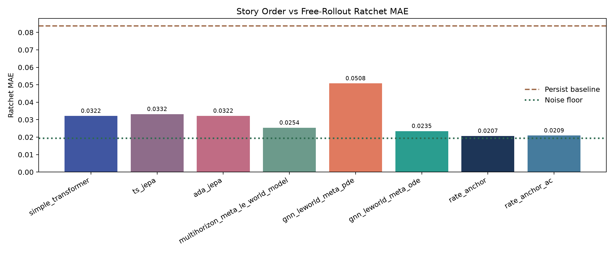
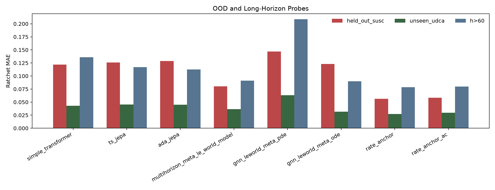
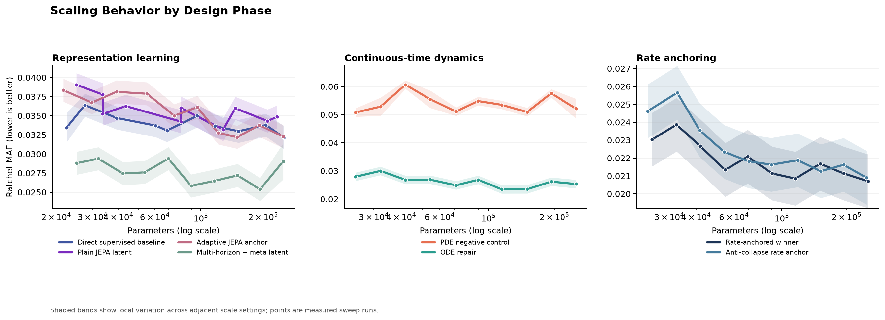
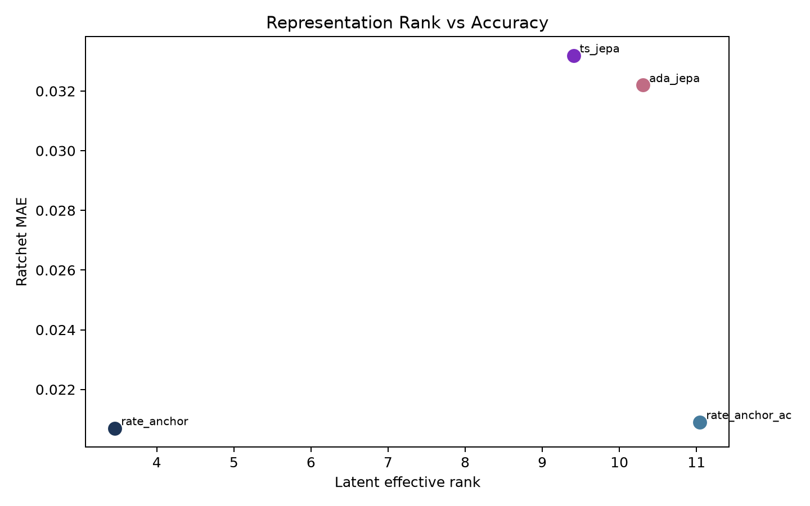
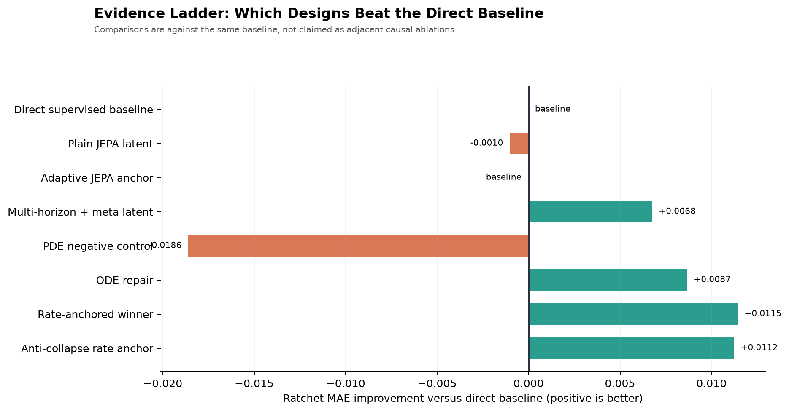
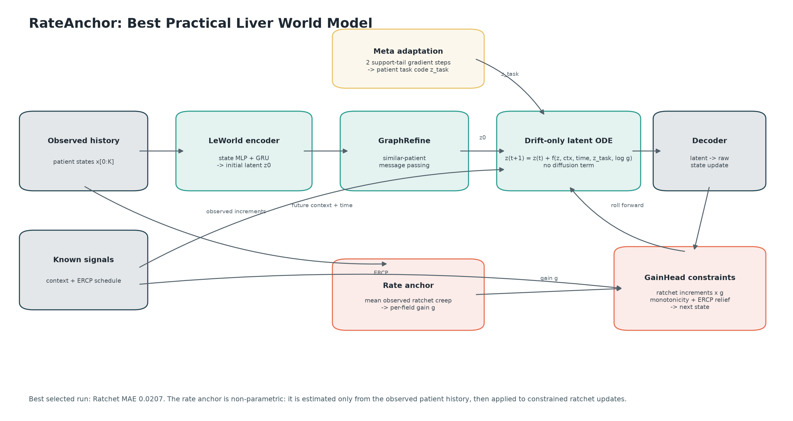

# Liver World Model

> A compact evidence package for comparing eight synthetic liver disease world-model prototypes, with `RateAnchor` selected as the practical winner.

| Package focus | Current recommendation | Primary artifact | Status |
|---|---:|---|---|
| Constraint-safe long-horizon forecasting | `rate_anchor` | [DECISION_MEMO.md](DECISION_MEMO.md) | Evidence package |

## At A Glance

This repository packages the core evidence behind a small model-selection study for synthetic liver disease progression. The goal is not to claim clinical validity. The goal is to compare candidate world-model architectures under free-rollout evaluation, out-of-distribution probes, and hard clinical constraints.

The current recommendation is **RateAnchor** because it offers the best observed balance of:

- low ratchet-field rollout error,
- strong held-out susceptibility robustness,
- strong unseen-treatment timing robustness,
- zero recorded constraint violations,
- patient-specific rate calibration that is easier to audit than a plain black-box rollout.

## What This Repo Contains

| Area | Contents |
|---|---|
| Decision | [DECISION_MEMO.md](DECISION_MEMO.md) with the architecture choice and caveats |
| Rebuild instructions | [RUNBOOK.md](RUNBOOK.md) with setup, verification, and retraining commands |
| Core code | `code/` for training, evaluation, inference, data loading, and model definitions |
| Metrics | `artifacts/best_runs/`, `artifacts/deep_metrics/`, and `artifacts/sweeps/` |
| Visuals | `plots/` with prebuilt comparison figures |
| Data manifest | `data/manifest.json` plus packaged dataset files present in this workspace |

## Model Comparison

All headline metrics below are from the packaged selected-eight manifest and best-run artifacts.
Lower MAE is better.

| Model | Family | Params | Ratchet MAE | Held-out Susc. | Unseen UDCA | Beyond Horizon | Latent Rank | Verdict |
|---|---|---:|---:|---:|---:|---:|---:|---|
| `simple_transformer` | Baseline | 251,977 | 0.0322 | 0.1217 | 0.0431 | 0.1358 | - | Simple baseline, weak event behavior |
| `ts_jepa` | JEPA | 128,305 | 0.0332 | 0.1259 | 0.0452 | 0.1169 | 9.41 | Honest negative result |
| `ada_jepa` | JEPA | 149,680 | 0.0322 | 0.1289 | 0.0448 | 0.1124 | 10.31 | Better long-horizon JEPA variant |
| `multihorizon_meta_le_world_model` | Latent + Meta | 193,431 | 0.0254 | 0.0802 | 0.0364 | 0.0910 | - | First strong all-around latent model |
| `gnn_leworld_meta_pde` | Continuous-time | 24,732 | 0.0508 | 0.1468 | 0.0631 | 0.2087 | - | Negative control; diffusion hurts |
| `gnn_leworld_meta_ode` | Continuous-time | 114,975 | 0.0235 | 0.1230 | 0.0316 | 0.0899 | - | ODE repair recovers performance |
| `rate_anchor` | Rate invariance | 251,588 | **0.0207** | **0.0563** | **0.0274** | **0.0788** | 3.46 | **Recommended prototype** |
| `rate_anchor_ac` | Rate invariance | 247,012 | 0.0209 | 0.0582 | 0.0295 | 0.0798 | **11.05** | Higher-rank follow-up, not better overall |

## Cost And Footprint

This package does not record portable wall-clock training time by machine, so the most honest "cost" comparison is the rebuild footprint: parameter count, selected scale, and epoch budget.

| Model | Params | Selected Scale | Epochs | Relative Rebuild Cost |
|---|---:|---:|---:|---|
| `simple_transformer` | 251,977 | 1.9141 | 15 | Medium |
| `ts_jepa` | 128,305 | 1.1146 | 15 | Low-medium |
| `ada_jepa` | 149,680 | 1.3807 | 15 | Medium |
| `multihorizon_meta_le_world_model` | 193,431 | 2.2135 | 15 | Medium |
| `gnn_leworld_meta_pde` | 24,732 | 1.4531 | 15 | Low |
| `gnn_leworld_meta_ode` | 114,975 | 3.2708 | 15 | Low-medium |
| `rate_anchor` | 251,588 | 4.8542 | 15 | Medium-high |
| `rate_anchor_ac` | 247,012 | 3.6042 | 15 | Medium-high |

## Why `RateAnchor` Wins

| Question | Evidence |
|---|---|
| Does it improve the main rollout metric? | Best ratchet MAE: `0.0207` |
| Does it stay safe under rollout? | `0` constraint violations in packaged results |
| Does it hold up under OOD stress? | Best held-out susceptibility MAE: `0.0563` |
| Does it generalize beyond training horizon? | Best beyond-horizon MAE: `0.0788` |
| Is it inspectable? | Yes; observed patient-specific creep directly modulates predicted ratchet increments |

## Visual Story

### Headline Plots





### Supporting Diagnostics





## Quick Start

Use Python `3.10` to `3.12`.

```powershell
python -m venv .venv
.\.venv\Scripts\Activate.ps1
python -m pip install --upgrade pip
python -m pip install -r requirements.txt
```

Run the integrity checker:

```powershell
python scripts/verify_package.py
```

Rebuild the selected `RateAnchor` configuration:

```powershell
python code/training.py --model rate_anchor --epochs 15 --scale 4.854166666727
python code/eval.py --model rate_anchor --json artifacts/best_runs/rate_anchor.json
```

Run patient-level inference with a trained checkpoint:

```powershell
python code/inference.py --model rate_anchor --ckpt checkpoints/rate_anchor.pt --csv data/liver_data.csv --patient 0 --observe 24
```

## Package Status And Caveats

| Item | Current state |
|---|---|
| Clinical claim | Not supported; this is a synthetic-data comparison package |
| Winning checkpoint | Not bundled intentionally |
| Best-run metrics | Bundled |
| Sweep artifacts | Bundled |
| Deep metrics | Bundled for selected models |
| Constraint-safe heads | Bundled in source |
| Dataset completeness in this workspace | `data/liver_data_long.csv` is present; `data/manifest.json` also references `data/liver_data.csv`, which is not currently present here |

Two important caveats:

1. Strong performance here does **not** prove real liver biology was learned. The generator is both the data source and the scoring world.
2. The packaged verifier currently expects `data/liver_data.csv` from `data/manifest.json`, so verification will fail until that file is restored to this workspace.

## Repository Layout

| Path | Purpose |
|---|---|
| `code/models/` | Model families and constrained heads |
| `code/training.py` | Training entry point |
| `code/eval.py` | Rollout and OOD evaluation |
| `code/inference.py` | Patient-level rollout/inference |
| `scripts/verify_package.py` | Integrity verification |
| `scripts/build_selected8_package.py` | Maintainer package rebuild |
| `artifacts/selected8_manifest.json` | Canonical selected-eight summary |
| `artifacts/best_runs/` | Best-run metrics by model |
| `artifacts/deep_metrics/` | Rich diagnostics for selected models |
| `plots/` | Pre-rendered figures for review |

## Recommended Reading Order

1. [DECISION_MEMO.md](DECISION_MEMO.md)
2. This `README.md`
3. [RUNBOOK.md](RUNBOOK.md)
4. `artifacts/selected8_manifest.json`
5. `artifacts/deep_metrics/`

## Bottom Line

If you need one prototype to carry forward from this package, start with **`rate_anchor`**. It is the strongest recorded model on the main accuracy and OOD metrics while preserving the hard rollout constraints that matter for this synthetic task.
